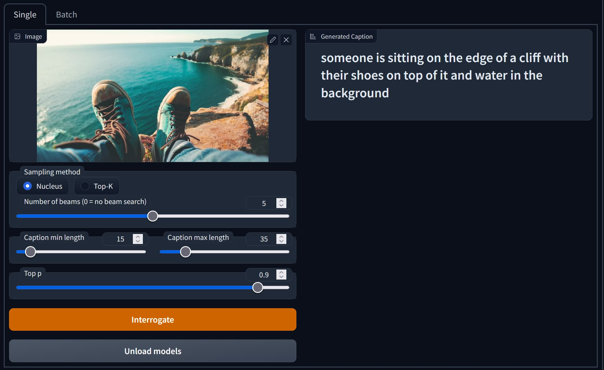

# stable-diffusion-webui-blip2-captioner

BLIP2 captioning tool as an extension of AUTOMATIC's WebUI.

# Screenshots

# Features

- Lightweight models without large language models (the `coco` model only)
- Batch processing

# Parameters

| Name               | Values               | Default   | Description                                                                                    |
| ------------------ | -------------------- | --------- | ---------------------------------------------------------------------------------------------- |
| Sampling method    | `Nucleus` or `Top-K` | `Nucleus` | I don't know the difference. sorry.                                                            |
| Number of beams    | ≧ 0                  | `3`       | Number of beams for beam search. 1 means no beam search.                                       |
| Caption min length | ≧ 0                  | 10        | The minimum length of the caption to be generated. If very large, caption accuracy may degrade |
| Caption max length | ≧ Caption min length | 30        | The minimum length of the caption to be generated.                                             |
| Top P              | ≧ 0.0                | 0.9       | The cumulative probability for nucleus sampling.                                               |

# License
This software includes the following third-party libraries:
- [salesforce-lavis](https://github.com/salesforce/LAVIS/tree/main/projects/blip2) (BSD-3-Clause License)

